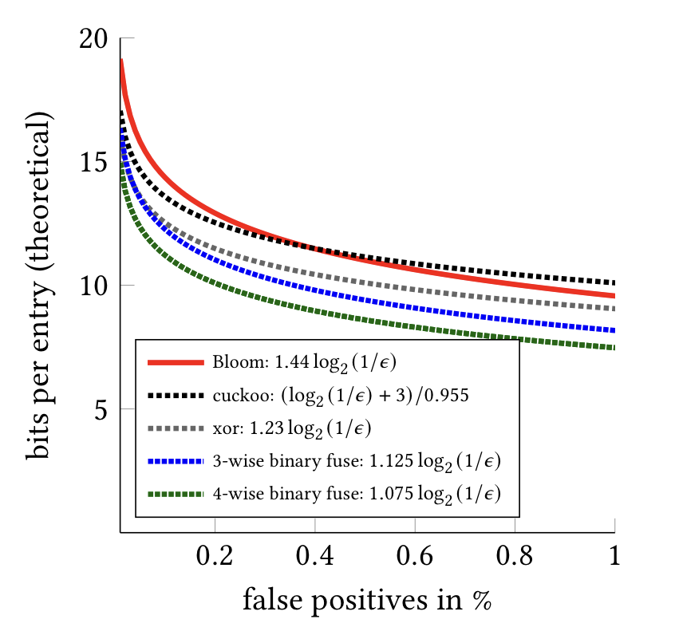

## Fast Approximate Filters  

## About

Fast filters to check whether an element is in the set. These data structures are
probabilistic, meaning they have certain probability for false positives, but 
they are never wrong when item was actually in the initial set. What is more,
space usage and speed of access is excellent for these data structures. 

This Julia package is based of [binaryfusefilter.h](https://github.com/FastFilter/xor_singleheader/blob/master/include/binaryfusefilter.h).
Currently only binary fuse filters are re-implemented, but we support UInt8, UInt16 and UInt32 fingerprints.

Feel free to make a PR with other implementations.

## Citations

If using this code for scientific settings please cite the relevant papers:

* Thomas Mueller Graf,  Daniel Lemire, [Binary Fuse Filters: Fast and Smaller Than Xor Filters](https://dl.acm.org/doi/abs/10.1145/3510449), ACM Journal of Experimental Algorithmics 27, 2022. DOI: 10.1145/3510449
* Thomas Mueller Graf,  Daniel Lemire, [Xor Filters: Faster and Smaller Than Bloom and Cuckoo Filters](https://arxiv.org/abs/1912.08258), Journal of Experimental Algorithmics 25, 2020. DOI: 10.1145/3376122



## Usage

```julia
using FastFilter
?BinaryFuseFilter
```
